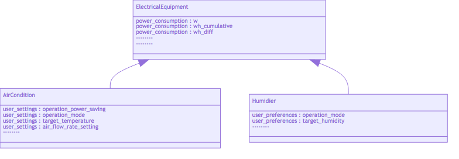

<!-- START doctoc generated TOC please keep comment here to allow auto update -->
<!-- DON'T EDIT THIS SECTION, INSTEAD RE-RUN doctoc TO UPDATE -->
**Table of Contents**  *generated with [DocToc](https://github.com/thlorenz/doctoc)*

- [Concept](#concept)
  - [`type` for Things (Peripheral/Sensor/Actuator)](#type-for-things-peripheralsensoractuator)
  - [`id` for Things (Peripheral)](#id-for-things-peripheral)
- [Design with Tools](#design-with-tools)
  - [Schema Source](#schema-source)
  - [Generate Class Diagram](#generate-class-diagram)
  - [Generate Markdown Document](#generate-markdown-document)
  - [Generate Class Hierarchy in JSON](#generate-class-hierarchy-in-json)
- [Simulation with Tools](#simulation-with-tools)
  - [Generate Time-Series Random data from Schema (JSON)](#generate-time-series-random-data-from-schema-json)
  - [Write Time-Series data to local TSDB](#write-time-series-data-to-local-tsdb)
  - [Generate Grafana Dashboard Config (JSON)](#generate-grafana-dashboard-config-json)
  - [Dummy Data Server](#dummy-data-server)
  - [Web Viewer (Dashboard)](#web-viewer-dashboard)
  - [Mobile Viewer (App)](#mobile-viewer-app)
- [References](#references)

<!-- END doctoc generated TOC please keep comment here to allow auto update -->

## Concept

In [IoT](https://en.wikipedia.org/wiki/Internet_of_things) development, typically following questions must be answered in your system design:

1. Where is the **Thing**?
2. What is the status of that **Thing**?
3. How to control that **Thing** to manipulate physical world?

For Q1, it means to locate that thing _individually_ with an _unique_ URL such as `https://server/xxx/yyy/www/zzz`). The tree hierarchy of these connected Things (`xxx/yyy/www/zzz`) shall be simple and easy to understand.

For Q2, with the defined thing hierarchy, the `status data` of each Thing can be uploaded to cloud and stored in the database. All clients of the system can access those `status data` of selected Things via pull (REST) or push (Websocket) way. Typically, we call those `status data` as `sensor data` for physical world or logical system.

In TicTacToe, it's assumed that all Things are connected directly/indirectly to the cloud as following diagram:


The diagram has these Things (Objects):

- Peripheral, the Thing is composed of Sensors (and maybe Actuators)
  - connect to cloud directly with Mobile Network (3G/4G)
  - connect to cloud indirectly via Gateway, with wired/wireless connection (e.g. BluetoothLE, Zigbee, Z-Wave, LoRa, ...)
- Gateway
  - more computation powers
  - more types of connectivities for local Thing network
  - more storage as data caches for local Thing network
  - be able to connect to cloud via one or more network bearers 
  - capable for autonomous control among nearby Peripherals when offline to Internet 
- Sensor, ...
- Actuator, ...
- Mobile Phone, a special type of Gateway

In order to address the location of any Thing in physical world, TicTacToe uses [VirtualMemory](https://en.wikipedia.org/wiki/Virtual_memory) concept to design a simple Thing (tree) hierarchy with 6 levels to describe IoT connectivities:

1. `profile_type` (a.k.a. `profile`)
2. `profile_id` (a.k.a. `id`)
3. `peripheral_type` (a.k.a `p_type`)
4. `peripheral_id` (a.k.a `p_id`)
5. `sensor_type` / `actuator_type` (`s_type`)
6. `sensor_id` / `actuator_id` (`s_id`)

Like [VirtualMemory](https://en.wikipedia.org/wiki/Virtual_memory), OS kernel can translate `virtual memory address` with its `process` to `physical memory address`, applications with TicTacToe can anchor the Thing and its location in physical world by using `type` and `id`. So, considering the connectivity `sensor -> peripheral -> gateway -> cloud`:

- `profile/id`, with **profile_type** (`profile`) and **profile_id** (`id`), Tic can know where Gateway it is.
- `profile/id/p_type/p_id`, With **peripheral_type** and **peripheral_id**, Tic can know where Peripheral it is, via Gateway.
- `profile/id/p_type/p_id/s_type/s_id`, With **sensor_type** and **sensor_id**, Tic can know where Sensor it is, via Gateway and the associated Peripheral.

### `type` for Things (Peripheral/Sensor/Actuator)

The `type` of Peripheral/Sensor/Actuator Objects can be designed with the concept [Class](https://en.wikipedia.org/wiki/Class_(computer_programming)) in Object-Oriented Programming. In order to model Things in physical world to virtual objects with feasibility, the [Inheritance](https://en.wikipedia.org/wiki/Inheritance_(object-oriented_programming)) concept shall be used:


For example, both AirCondition and Humidifier are home appliances that have same attributes (power consumption from time to time) and controls (switch on/off). These types can be modeled in OOP way as below:

```ruby
class ElectricalEquipment
  power_consumption:
    * field: \w               # walt?
    * field: \wh_cumulative   # ...
    * field: \wh_diff
  power_switch:
    * field: \on              # true / false

class AirCondition extends ElectricalEquipment
  user_settings:
    * field: \operation_power_saving
    * field: \operation_mode
    * field: \target_temperature
    * field: \air_flow_rate_setting

class Humidier extends ElectricalEquipment
  user_preferences:
    * field: \operation_mode
    * field: \target_humidity
```

Treat class name as `peripheral_type`, while member field as `sensor_type` (or `actuator_type`), the schema for AirCondition and Humidifier shall look like following table:

| p_type | s_type | fields |
|---|---|---|
| `air_condition` | `power_consumption` | `w`, `wh_cumulative`, `wh_diff` |
| `air_condition` | `power_switch` | `on` |
| `air_condition` | `user_settings ` | `operation_power_saving`, `operation_mode`, `target_temperature`, `air_flow_rate_setting ` |
| `humidifier` | `power_consumption` | `w`, `wh_cumulative`, `wh_diff` |
| `humidifier` | `power_switch` | `on` |
| `humidifier` | `user_preferences` | `operation_mode`, `target_humidity` |


### `id` for Things (Peripheral)

In the same `type`, the id (identity) is used to distinguish Things (Peripheral Objects) individually. When designing the schema, the `id` can be decided from one of following choices:

1. globally-unique id
2. locally-unique id
3. auto-incremental number generated by Gateway that manages the Peripheral Object

Globally-unique identity, no matter how the Peripheral Object is connected to Internet, the identity is unique globally. For example, Bluetooth mac address.

Locally-unique identity, the identity is only unique to Gateway that manages the Peripheral Object. For example, the slave address in Modbus protocol, the port number of serial communication (e.g. `ttyS3`).

Auto-incremental number generated by the Gateway, is used to distinguish Peripheral Objects that can connect to Gateway with more than one protocol.

Mapping to memory management in computer world, the first one is physical-memory-addressing (direct access), while later 2 choices are virtual-memory-address (indirect access).


## Design with Tools

The top 2 levels (`profile` and `id`) are decided at very early stage (because of project name, service name, product name ...), but the rest 4 levels need to be designed/simulated/tested back-and-forth. So, the toolkits in the repository are created to accelerate the schema design process of these 4 levels:

- `peripheral_type` (a.k.a `p_type`)
- `peripheral_id` (a.k.a `p_id`)
- `sensor_type` / `actuator_type` (`s_type`)
- `sensor_id` / `actuator_id` (`s_id`)


### Schema Source

The schema is described as Javascript objects, but written in [Livescript](http://livescript.net/) to ease syntax. For example:

```ruby
class ElectricalEquipment
  power_consumption:
    * field: \w               # walt?
    * field: \wh_cumulative   # ...
    * field: \wh_diff
  power_switch:
    * field: \on              # true / false

class AirCondition extends ElectricalEquipment
  user_settings:
    * field: \operation_power_saving
    * field: \operation_mode
    * field: \target_temperature
    * field: \air_flow_rate_setting

class Humidier extends ElectricalEquipment
  user_preferences:
    * field: \operation_mode
    * field: \target_humidity

module.exports = exports = {
  ElectricalEquipment,
  AirCondition,
  Humidier
}
```

The equivalent javascript looks like this:

```javascript
// Generated by LiveScript 1.5.0
(function(){
  var ElectricalEquipment, AirCondition, Humidier, exports;
  ElectricalEquipment = (function(){
    ElectricalEquipment.displayName = 'ElectricalEquipment';
    var prototype = ElectricalEquipment.prototype, constructor = ElectricalEquipment;
    ElectricalEquipment.prototype.power_consumption = [
      {
        field: 'w'
      }, {
        field: 'wh_cumulative'
      }, {
        field: 'wh_diff'
      }
    ];
    ElectricalEquipment.prototype.power_switch = {
      field: 'on'
    };
    function ElectricalEquipment(){}
    return ElectricalEquipment;
  }());
  AirCondition = (function(superclass){
    var prototype = extend$((import$(AirCondition, superclass).displayName = 'AirCondition', AirCondition), superclass).prototype, constructor = AirCondition;
    AirCondition.prototype.user_settings = [
      {
        field: 'operation_power_saving'
      }, {
        field: 'operation_mode'
      }, {
        field: 'target_temperature'
      }, {
        field: 'air_flow_rate_setting'
      }
    ];
    function AirCondition(){
      AirCondition.superclass.apply(this, arguments);
    }
    return AirCondition;
  }(ElectricalEquipment));
  Humidier = (function(superclass){
    var prototype = extend$((import$(Humidier, superclass).displayName = 'Humidier', Humidier), superclass).prototype, constructor = Humidier;
    Humidier.prototype.user_preferences = [
      {
        field: 'operation_mode'
      }, {
        field: 'target_humidity'
      }
    ];
    function Humidier(){
      Humidier.superclass.apply(this, arguments);
    }
    return Humidier;
  }(ElectricalEquipment));
  module.exports = exports = {
    ElectricalEquipment: ElectricalEquipment,
    AirCondition: AirCondition,
    Humidier: Humidier
  };
  function extend$(sub, sup){
    function fun(){} fun.prototype = (sub.superclass = sup).prototype;
    (sub.prototype = new fun).constructor = sub;
    if (typeof sup.extended == 'function') sup.extended(sub);
    return sub;
  }
  function import$(obj, src){
    var own = {}.hasOwnProperty;
    for (var key in src) if (own.call(src, key)) obj[key] = src[key];
    return obj;
  }
}).call(this);
```

This example can be found in `examples/electrical_equipment/schema.ls`.


### Generate Class Diagram

To use schema compiler, please run `npm install && npm run build` first.

```text
$ node ./lib/schema-compiler.js -s examples/electrical_equipment/schema.ls -f mermaid

You can copy and paste following text to https://mermaidjs.github.io/mermaid-live-editor/
to generate SVG:
------

classDiagram
ElectricalEquipment <|-- AirCondition
ElectricalEquipment <|-- Humidier
ElectricalEquipment : power_consumption : w
ElectricalEquipment : power_consumption : wh_cumulative
ElectricalEquipment : power_consumption : wh_diff
ElectricalEquipment : --------
ElectricalEquipment : --------
AirCondition : user_settings : operation_power_saving
AirCondition : user_settings : operation_mode
AirCondition : user_settings : target_temperature
AirCondition : user_settings : air_flow_rate_setting
AirCondition : --------
Humidier : user_preferences : operation_mode
Humidier : user_preferences : target_humidity
Humidier : --------

------
Or, run this command:

    ./node_modules/mermaid.cli/index.bundle.js -i examples/electrical_equipment/schema.ls.mmd -o examples/electrical_equipment/schema.ls.mmd.png
    ./node_modules/mermaid.cli/index.bundle.js -i examples/electrical_equipment/schema.ls.mmd -o examples/electrical_equipment/schema.ls.mmd.pdf
    ./node_modules/mermaid.cli/index.bundle.js -i examples/electrical_equipment/schema.ls.mmd -o examples/electrical_equipment/schema.ls.mmd.svg
    open examples/electrical_equipment/schema.ls.mmd.png
    open examples/electrical_equipment/schema.ls.mmd.pdf
    open -a "Google Chrome" examples/electrical_equipment/schema.ls.mmd.svg
```

Here is the generated class diagram:




### Generate Markdown Document

```text
$ node ./lib/schema-compiler.js -s examples/electrical_equipment/schema.ls -f markdown
written to examples/electrical_equipment/schema.ls.md
```

The generated markdown document can be found [schema.ls.md](schema.ls.md).


### Generate Class Hierarchy in JSON

```text
$ node ./lib/schema-compiler.js -s examples/electrical_equipment/schema.ls -f json && 
written to examples/electrical_equipment/schema.ls.json
```

The generated json looks like this:

```json
[
  {
    "name": "ElectricalEquipment",
    "parent": null,
    "p_type": "electrical_equipment",
    "s_types": {
      "power_consumption": [
        "w",
        "wh_cumulative",
        "wh_diff"
      ],
      "power_switch": []
    }
  },
  {
    "name": "AirCondition",
    "parent": "ElectricalEquipment",
    "p_type": "air_condition",
    "s_types": {
      "user_settings": [
        "operation_power_saving",
        "operation_mode",
        "target_temperature",
        "air_flow_rate_setting"
      ],
      "power_consumption": [
        "w",
        "wh_cumulative",
        "wh_diff"
      ],
      "power_switch": []
    }
  },
  {
    "name": "Humidier",
    "parent": "ElectricalEquipment",
    "p_type": "humidier",
    "s_types": {
      "user_preferences": [
        "operation_mode",
        "target_humidity"
      ],
      "power_consumption": [
        "w",
        "wh_cumulative",
        "wh_diff"
      ],
      "power_switch": []
    }
  }
]
```

Or you can view it in more pretty way:

```text
$ cat examples/electrical_equipment/schema.ls.json | prettyjson --inline-arrays=1
-
  name:    ElectricalEquipment
  parent:  null
  p_type:  electrical_equipment
  s_types:
    power_consumption: w, wh_cumulative, wh_diff
    power_switch:
      (empty array)
-
  name:    AirCondition
  parent:  ElectricalEquipment
  p_type:  air_condition
  s_types:
    user_settings:     operation_power_saving, operation_mode, target_temperature, air_flow_rate_setting
    power_consumption: w, wh_cumulative, wh_diff
    power_switch:
      (empty array)
-
  name:    Humidier
  parent:  ElectricalEquipment
  p_type:  humidier
  s_types:
    user_preferences:  operation_mode, target_humidity
    power_consumption: w, wh_cumulative, wh_diff
    power_switch:
      (empty array)
```


## Simulation with Tools

### Generate Time-Series Random data from Schema (JSON)

From above given schema source (in livescript or json format), generate random time series data as below:

```text
3015 sensorboard/ttyO4/humidity/0 temperature=26.7 humidity=80.3
3211 sensorboard/ttyO4/humidity/1 temperature=27.6 humidity=77.2
3308 sensorboard/ttyO4/co2/_ co2=711
3400 sensorboard/ttyO4/ambient_light/_ illuminance=0
3502 sensorboard/ttyO4/water_level/high_bound detected=true
3601 sensorboard/ttyO4/water_level/low_bound detected=true
9032 sensorboard/ttyO4/humidity/0 temperature=26.7 humidity=80.3
9224 sensorboard/ttyO4/humidity/1 temperature=27.6 humidity=77.2
```

First field is the `uptime` since the Data Generator starts. Second field are `p_type/p_id/s_type/s_id`, and rest fields are key-value pairs for data.

The generator can keep generating random data to console, which can be piped to next data processor.


### Write Time-Series data to local TSDB

The TSDB instance can be easily setup with Docker.

Random data generator to generate data to stdout that is piped to the data processor, that can write these data to local TSDB (e.g. [Influxdb](https://www.influxdata.com/) with [LINE protocol](https://docs.influxdata.com/influxdb/v1.4/write_protocols/line_protocol_tutorial/)). 

```text
weather,location=us-midwest temperature=82 1465839830100400200
  |    -------------------- --------------  |
  |             |             |             |
  |             |             |             |
+-----------+--------+-+---------+-+---------+
|measurement|,tag_set| |field_set| |timestamp|
+-----------+--------+-+---------+-+---------+
```

Taking [Influxdb](https://www.influxdata.com/) as example, the mappings between TicTacToe tree hierarchy and Influxdb schema is listed as following table:

| influxdb | tictactoe | explanations |
|---|---|---|
| database name | `profile` | |
| measurement name | `[node].[p_type].[s_type]` | |
| tag sets | `peripheral_id` and `sensor_id` | |
| fields | fields | |


### Generate Grafana Dashboard Config (JSON)

With TSDB schema, the dashboard settings ([Grafana JSON](http://docs.grafana.org/reference/export_import/)) can be generated. So, user can setup Grafana with Docker, and then import the dashboard settings (json) to view these randomly-generated time series data from time to time.


### Dummy Data Server

Generate query statements to read latest snapshot data from influxdb, and output as json data that can be easily de serialized to javascript objects for later access. Maybe a standalone rest service can be created.


### Web Viewer (Dashboard)

Generate engineering dashboard based on the given schema and javascript bean objects.


### Mobile Viewer (App)

Generate a Mobile app as viewer to local TSDB for these randomly-generated time series data.


## References

Perform actuator's action in SensorWeb:

```python
  ##
  # Request to perform an action with the actuator on the peripheral (board or machine)
  # associated with the host/node running SensorWeb.
  #
  # @p_type         the type of peripheral (board or machine) associated with the host/node that
  #                 runs SensorWeb, e.g. sensorboard, mainboard, echonetlite, hvac,
  #                 and so on... The associate is either wired (e.g. UART, RS485,
  #                 I2C, ...) or wireless (Bluetooth LE, 802.11a/b/g, LoRa, or ZigBee).
  #
  # @p_id           the unique id of the board (or machine) associated with the host/node.
  #                 Sometimes, one host/node might associate more than one board with same
  #                 type, e.g. A home gateway is associated with 3 BLE coffee machines
  #                 in a coffee shop, and use the BLE mac address of each coffee machine
  #                 as its unique identity.
  #
  # @a_type         the type of actuator on the board (or machine) associated with the host/node,
  #                 such as fan, pump, led, led-matrix, and so on.
  #
  # @a_id           the unique id of actuator on the same board (or same machine), because one
  #                 board (or machine) might have more than one actuator with same type. For
  #                 example, an A/C might might have 2 FANs with different identity: 0000 and
  #                 0001.
  #
  # @action         the supported action of the actuator. Typically, the action `set` is the
  #                 most frequently supported. In some special types of actuators, there are
  #                 more supported actions. Taking led-matrix as example, here are the supported
  #                 actions:
  #                   - show-number, to display 00 ~ 99 number on led matrix.
  #                   - show-ascii, to display one visible ascii character on led matrix.
  #                   - show-animation, to play built-in animation on led matrix.
  #
  # @arg1           the 1st argument value for the action to be performed.
  # @arg2           the 2nd argument value for the action to be performed.
  # @arg3           the 3rd argument value for the action to be performed.
  #
  # @done           the callback function to indicate the request is successful or not.
  #                 when failure, the 1st argument `err` shall be the error object.
  #
  perform-action: (p_type, p_id, a_type, a_id, action, arg1, arg2, arg3, done) ->
    return done "unimplemented!!"
```

Broadcast sensor data update in SensorWeb:

```python
  ##
  # Broadcast sensor data update event.
  #
  # @p_type         the type of peripheral (board or machine) associated with the host/node that
  #                 runs SensorWeb, e.g. sensorboard, mainboard, echonetlite, hvac,
  #                 and so on... The association is either wired (e.g. UART, RS485,
  #                 I2C, ...) or wireless (Bluetooth LE, 802.11a/b/g, LoRa, or ZigBee).
  #
  # @p_id           the unique id of the board (or machine) associated with the host/node.
  #                 Sometimes, one host/node might associate more than one board with same
  #                 type, e.g. A home gateway is associated with 3 BLE coffee machines
  #                 in a coffee shop, and use the BLE mac address of each coffee machine
  #                 as its unique identity.
  #
  # @s_type         the type of sensor on the board/peripheral (or machine) associated with the host/node,
  #                 such as humidity sensor (e.g. st221), ambient light sensor (e.g. alspt315),
  #                 dust sensor (e.g. dust), ultrasonic sensor, and so on.
  #
  # @s_id           the unique id of sensor on the board/peripheral (or machine) associated with
  #                 the host/node. The unique identity is used to distigunish 2 sensors with
  #                 same type but for different purposes. For example, in a plant box, there are
  #                 2 humidity sensors, one is used to measure humidity/temperature inside the box
  #                 while another one is used to measurement same data outside the box.
  #
  # @points         the collection of data points measured by the specified sensor. Each data point
  #                 shall contain 2 fields: `data_type` and `value`. For example, a humidity sensor (st221)
  #                 shall measure humidity/temperature data, represented as below (in json format):
  #
  #                   [
  #                     {"data_type": "humidity"   , value: 65},
  #                     {"data_type": "temperature", value: 27.3}
  #                   ]
  #
  # @timestamp     the timestamp object indicates when the sensor data is measured. It can be
  #                null, that indicates the timestamp object shall be generated by the
  #                listener of sensor data update event. There are 3 fields in the timestamp
  #                object: epoch, uptime, and boots.
  #                 - epoch , the epoch time on the local Linux system that produces the sensor data event
  #                 - uptime, the system uptime of Linux system
  #                 - boots , the number of booting up times for the Linux system.
  #
  #                In most case, it is listener's responsibility to produce timestamp object in order to
  #                ensure information source is unique. However, for some special cases, multiple measurements
  #                are produced at the exactly-same timestamp, such as `linux_process/*/node/* cpu=xxx,memory=xxx`,
  #                but that cannot be emitted by single function call of `emit-data`. Then, it is better for
  #                event source to produce timestamp object to guarantee multiple measurements share same timestamp.
  #
  #                 linux_process/sensor_web/node/_ cpu=50,memory=22
  #                 linux_process/bt_web/node/_ cpu=23,memory=15
  #                 linux_process/tcp_proxy/node/_ cpu=37 memory=18
  #
  #               Please note, the timestamp argument can be null, then PeripheralService base class shall
  #               use the internal SystemUptime object to generate current timestamp object when SystemUptime
  #               exists. More information about SystemUptime, please refer to
  #               https://github.com/yagamy4680/yapps/blob/master/lib/system-uptime.ls
  #
  emit-data: (p_type, p_id, s_type, s_id, points, timestamp=null) ->
```